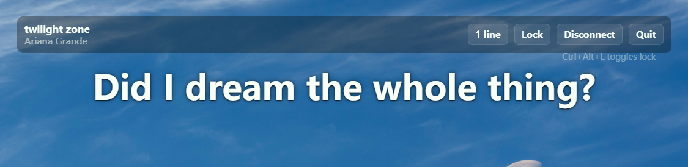

# Spotify Lyrics Overlay WPF

Native Windows lyrics overlay for Spotify, rebuilt with WPF instead of Electron. It keeps the same core workflow while avoiding Chromium, so it is lighter for a small always-on-top desktop utility.



## Features

- Spotify OAuth PKCE login
- Current playback polling through Spotify Web API
- Synced/plain lyrics lookup through LRCLIB
- Local token, settings, and lyrics cache
- Transparent always-on-top lyrics window
- Tray show/hide, lock/unlock, and quit
- `Ctrl+Alt+L` lock toggle
- Click-through lock mode
- One-line/two-line lyrics layout
- Font size and text color settings
- Self-contained and lite Windows installers

## Download

Two Windows x64 packages are produced in `dist/`:

- `SpotifyLyricsOverlay-Setup-Windows-x64.exe`: full installer, no extra .NET install required.
- `SpotifyLyricsOverlay-Setup-Windows-x64-lite.exe`: smaller installer, requires .NET 10 Desktop Runtime x64.

The app does not ship with a shared Spotify Client ID. Each user should create their own Spotify Developer app and paste their own Client ID.

## Spotify Setup

1. Go to the Spotify Developer Dashboard: <https://developer.spotify.com/dashboard>
2. Create an app.
3. Add this Redirect URI:

```text
http://127.0.0.1:8766/callback
```

4. Copy the app's Client ID.
5. Open Spotify Lyrics Overlay, paste the Client ID, and click `Connect`.

## Build

Requirements:

- Windows
- .NET 10 SDK
- Inno Setup 6, only needed for installer builds

Run from the repository root:

```powershell
powershell -ExecutionPolicy Bypass -File scripts\build-release.ps1
```

Manual development run:

```powershell
dotnet run
```

## Data

Settings, Spotify token, and lyrics cache are stored under:

```text
%APPDATA%\SpotifyLyricsOverlayWpf
```

## License

MIT. See [LICENSE](LICENSE).

## Third-party Services

This app calls Spotify Web API and LRCLIB at runtime. It does not vendor Spotify or LRCLIB source code. See [THIRD_PARTY_NOTICES.md](THIRD_PARTY_NOTICES.md).

---

# Spotify Lyrics Overlay WPF 中文说明

这是一个面向 Windows 的 Spotify 悬浮歌词工具，使用 WPF 原生重写，不再基于 Electron。核心功能保留，同时避免常驻 Chromium，适合这种简单的桌面悬浮工具。


## 功能

- Spotify OAuth PKCE 登录
- 通过 Spotify Web API 获取当前播放
- 通过 LRCLIB 获取同步歌词或纯文本歌词
- 本地保存 token、设置和歌词缓存
- 透明置顶歌词窗口
- 系统托盘显示/隐藏、锁定/解锁、退出
- `Ctrl+Alt+L` 快捷键锁定/解锁
- 锁定后点击穿透
- 单行/双行歌词模式
- 字号和文字颜色设置
- 提供完整安装包和轻量安装包

## 下载和安装

`dist/` 目录会生成两个 Windows x64 安装包：

- `SpotifyLyricsOverlay-Setup-Windows-x64.exe`：完整安装包，不需要用户额外安装 .NET。
- `SpotifyLyricsOverlay-Setup-Windows-x64-lite.exe`：轻量安装包，用户需要先安装 .NET 10 Desktop Runtime x64。

应用不会内置公共 Spotify Client ID。面向用户分发时，每个用户需要自己创建 Spotify Developer App，然后填写自己的 Client ID。

## Spotify 配置

1. 打开 Spotify Developer Dashboard：<https://developer.spotify.com/dashboard>
2. 创建一个 App。
3. 添加下面这个 Redirect URI：

```text
http://127.0.0.1:8766/callback
```

4. 复制 App 的 Client ID。
5. 打开 Spotify Lyrics Overlay，粘贴 Client ID，点击 `Connect` 授权。

## 构建

需要：

- Windows
- .NET 10 SDK
- Inno Setup 6，仅生成安装包时需要

在项目根目录运行：

```powershell
powershell -ExecutionPolicy Bypass -File scripts\build-release.ps1
```

开发时直接运行：

```powershell
dotnet run
```

## 本地数据

设置、Spotify token 和歌词缓存保存在：

```text
%APPDATA%\SpotifyLyricsOverlayWpf
```

## 许可证

本项目使用 MIT License，详见 [LICENSE](LICENSE)。

## 第三方服务

应用运行时会调用 Spotify Web API 和 LRCLIB。项目不包含 Spotify 或 LRCLIB 的源码。详见 [THIRD_PARTY_NOTICES.md](THIRD_PARTY_NOTICES.md)。
